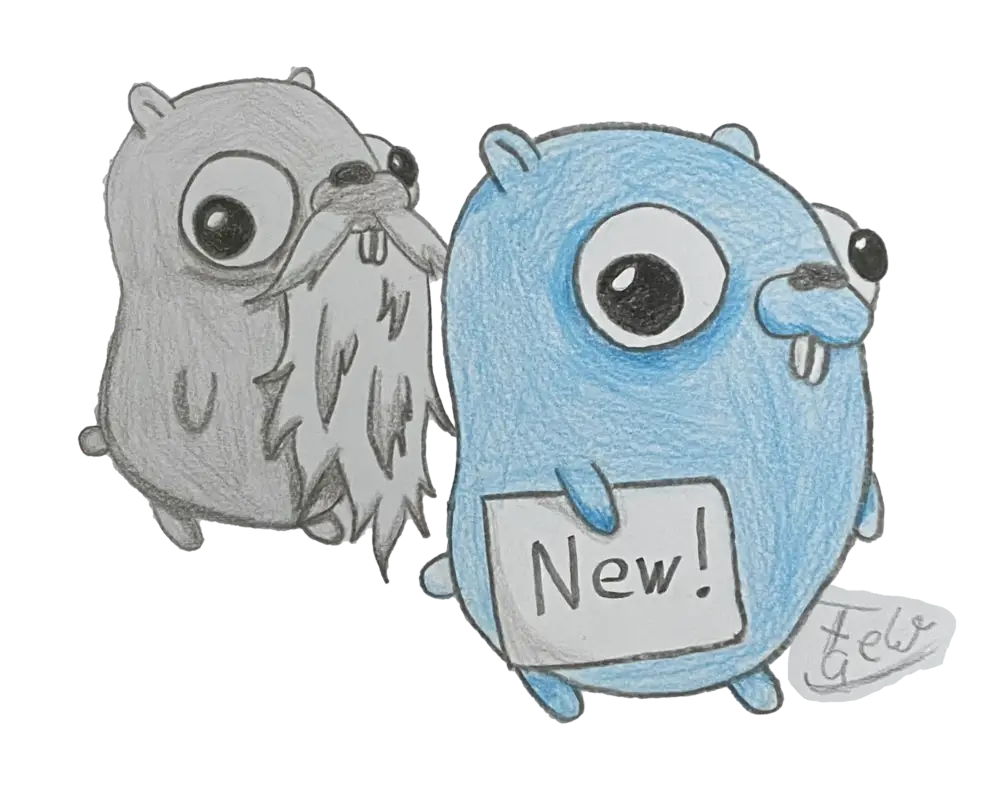

# gover
Quickly check for a new go version on go.dev. Plain and simple.
For doing that it needs a working internet connection.

Special thanks ❤️ to the wonderful human being contributing the gopher drawing to this (micro) project.

## Usage
```
> gover
Version on go.dev: 1.24.5
```

## How it works
1. Load https://go.dev/dl/
2. perform a regex search for the current version number
3. done

## Get it
Download the latest built executables or build it yourself.

When you get the executables on MacOS you need to run
`xattr -d com.apple.quarantine <Binary>` to start it on the command line.